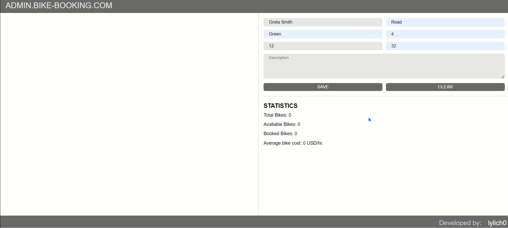

<a name="readme-top"></a>
<h1 align="center"><b>Bike Booking System</b></h1>

---

## Description
**The Bike Booking System** is a solution designed for administrators to efficiently manage the bikes for renting. 
This system provides a user-friendly interface for administrators to control and monitor the availability and usage of bikes.


<p align="right">(<a href="#readme-top">back to top</a>)</p>

---
## Prerequisites

Make sure you have the following installed on your machine:
- Node.js 
- MongoDB

<p align="right">(<a href="#readme-top">back to top</a>)</p>

---

## Installation 

1. Clone the Repository
```
git clone https://github.com/lylich0/bike-booking.git
```
2. Navigate to the Project Directory
```
cd app
```
3. Install Dependencies
```
npm install
```
4. Start MongoDB
```
mongod
```
5. Configure Database Connection

Open server.js and ensure that the following line is present with your MongoDB connection string.
Make sure you have a local database named bikes.
```
mongoose.connect('mongodb://localhost:27017/bikes', { useNewUrlParser: true, useUnifiedTopology: true });
```
6. Run the Application
```
npm start
```
```
node server/server.js
```

<p align="right">(<a href="#readme-top">back to top</a>)</p>

--- 

## Usage
- Open your browser and navigate to http://localhost:3000.
- The Bike Booking System should be accessible, and you can start managing bikes.

<p align="right">(<a href="#readme-top">back to top</a>)</p>